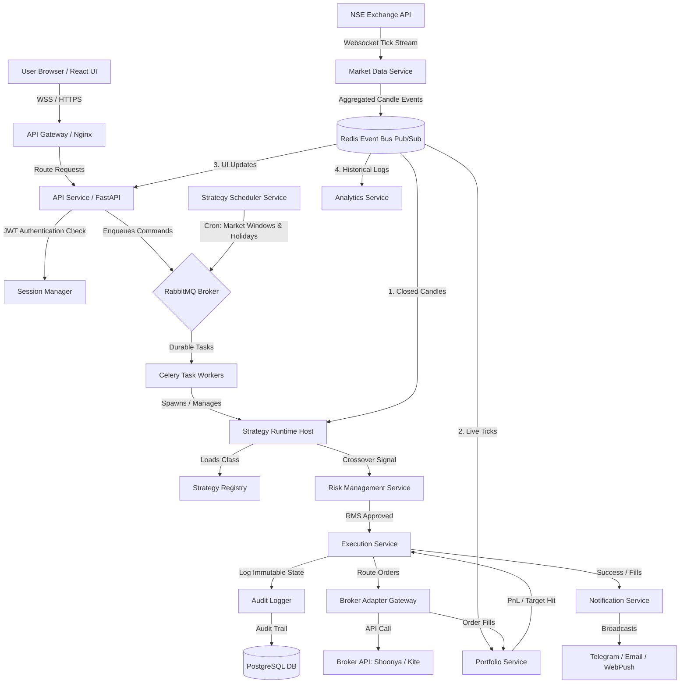

# Enterprise Options Trading SaaS Platform MVP

A production-grade, multi-tenant, cloud-native SaaS Options Trading Platform MVP built with **FastAPI**, **React (Vite)**, **Celery**, **RabbitMQ**, **Redis**, and **PostgreSQL**. 

This platform operates as an event-driven engine that aggregates real-time market ticks, computes indicators (Heikin-Ashi, WMA, SMA), triggers crossover signals, validates pre-trade risk controls, audits execution logs, and routes trades to simulated or live broker adapters.

---

## 1. System Architecture Layout

The platform follows a decoupled, service-oriented design. Services communicate asynchronously using **RabbitMQ** (for durable tasks) and **Redis** (for real-time market data distribution and WebSocket states).



---

## 2. Key Modules & Directory Structure

*   **`backend/app/core/`**: System configuration properties (`config.py`) and database engine initialization (`database.py`).
*   **`backend/app/db/`**: Core SQLAlchemy definitions for relational tables (`models.py`).
*   **`backend/app/broker/`**: Enforces a generic broker adapter blueprint (`base_adapter.py`) and includes a high-fidelity simulator (`mock_live_adapter.py`).
*   **`backend/app/services/`**:
    *   `execution.py`: Order validation, deduplication (idempotency key checks), and routing.
    *   `portfolio.py`: Position tracker, average fill pricing math, and unrealized/realized P&L calculations.
    *   `audit.py`: Logs immutable audits to SQL tables.
    *   `notifications.py`: Dispatches Email, Telegram, and Push notification alerts.
*   **`backend/app/engine/`**:
    *   `registry.py`: Abstract class mapping and dynamic strategy loaders.
    *   `runtime.py`: Generic strategy runtime host that evaluates crossover triggers.
    *   `market_data.py`: Ticks aggregator and Redis Pub/Sub candle event publisher.
    *   `rms.py`: Independent portfolio circuit breaker.
*   **`backend/app/workers/`**: Celery tasks configurations (`celery_app.py`) and loop tasks (`tasks.py`).
*   **`backend/app/main.py`**: FastAPI routing, auth session handlers, and real-time WebSockets streaming.
*   **`frontend/`**: Vite + React single page client styled with outrun glassmorphism raw CSS.

---

## 3. Local Installation & Run Guide

### Option A: Complete Docker Compose Deployment (Recommended)
This runs the API gateway, Postgres database, Redis cache, RabbitMQ queue, Celery worker nodes, and the React web dashboard simultaneously:

```bash
docker-compose up --build
```

Access points:
*   **React Dashboard UI**: `http://localhost:8000`
*   **FastAPI API Docs (Swagger)**: `http://localhost:8000/docs`
*   **RabbitMQ Dashboard**: `http://localhost:15672` (Username/Password: `guest` / `guest`)

### Option B: Local Developer Mode
1.  **Run Redis and RabbitMQ** locally on standard ports (`6379` and `5672`).
2.  **Start Backend API**:
    ```bash
    cd backend
    pip install -r requirements.txt
    uvicorn app.main:app --reload --port 8000
    ```
3.  **Start Celery Worker Node**:
    ```bash
    cd backend
    celery -A app.workers.celery_app worker --loglevel=info
    ```
4.  **Start Frontend Developer Server**:
    ```bash
    cd frontend
    npm install
    npm run dev
    ```

---

## 4. Telemetry, Health and Metrics

Exposes standard telemetry interfaces for infrastructure monitoring (Prometheus, Grafana, Loki):

*   **Health Check (`GET /health`)**: Returns connections state of dependencies.
    ```json
    {
      "status": "healthy",
      "database": "connected",
      "timestamp": "2026-07-09T14:47:45Z"
    }
    ```
*   **Prometheus metrics (`GET /metrics`)**: Exposes strategy execution loop metrics and trade counts.
    ```text
    # HELP active_strategy_subscriptions Total active trading subscribers
    # TYPE active_strategy_subscriptions gauge
    active_strategy_subscriptions 42
    ```

---

## 5. Verification Test Suite

Verify dynamic registry loading, HA transformations, and crossover indicator calculations:

```bash
python backend/tests/run_tests.py
```

*Output:*
```text
Running system validation tests...
[PASS] test_strategy_registration passed.
[PASS] test_indicator_calculations passed.
[PASS] test_heikin_ashi_transformation passed.

All validation tests passed successfully!
```